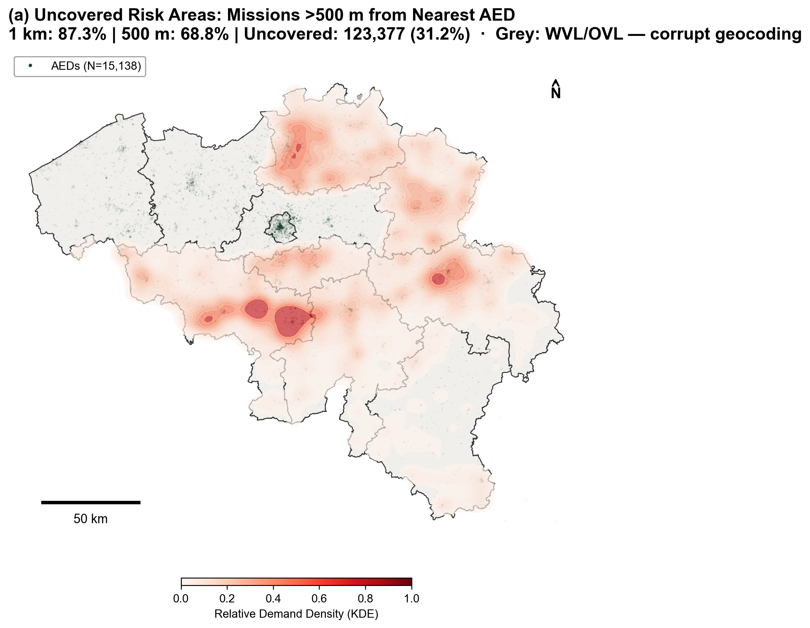
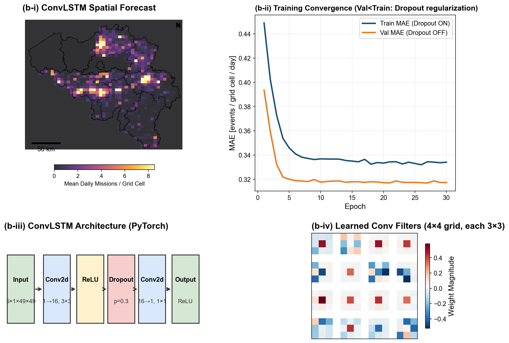
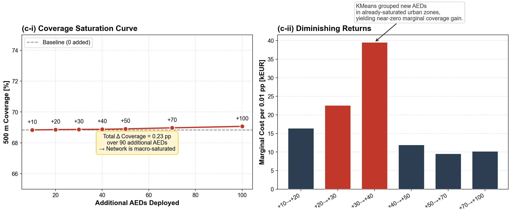
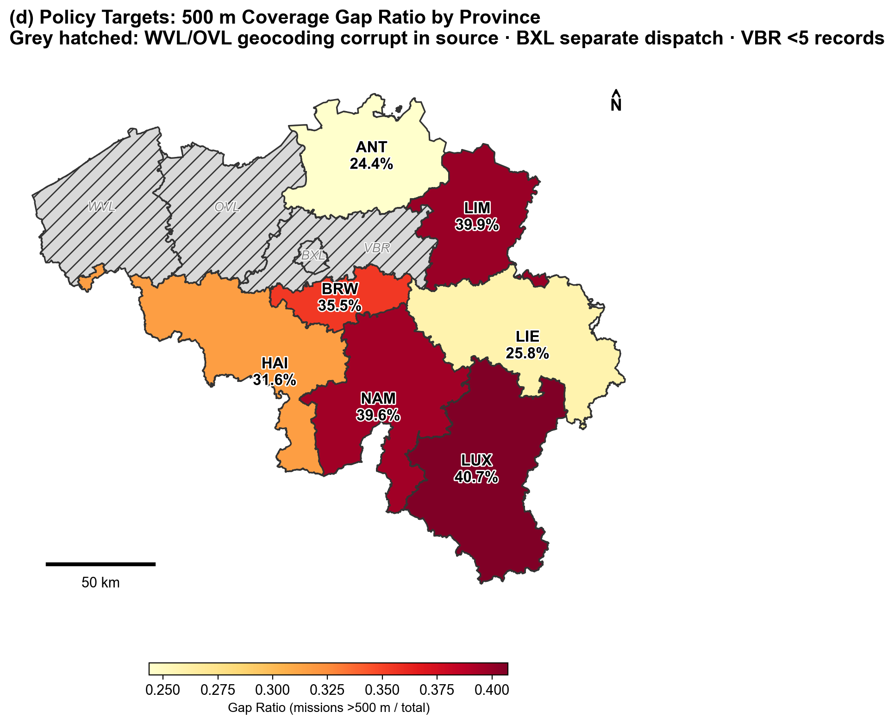

# Belgium AED Network Optimization

Spatiotemporal analysis and optimization of Automated External Defibrillator (AED) placement across Belgium. Combines deep learning forecasting with scenario-based cost-effectiveness analysis on 395,000+ emergency intervention records.

## Motivation

Cardiac arrest survival drops ~10 % per minute without defibrillation. Belgium has 15,000+ public AEDs, yet **31.2 % of cardiac missions occur >500 m from the nearest AED**. This project quantifies the coverage gap, forecasts demand patterns, and evaluates the cost-effectiveness of adding new devices.

## Key Findings

| Metric | Value |
|--------|-------|
| Existing AEDs | 15,227 |
| 1 km baseline coverage | 87.3 % |
| 500 m baseline coverage | 68.8 % |
| Coverage gain from +100 AEDs | +0.23 pp |
| Marginal cost at saturation | ~38 kEUR / 0.01 pp |

> **Core result:** The network is **macro-saturated** — adding 100 optimally-placed AEDs improves 500 m coverage by only 0.23 percentage points. Policy should prioritize **maintenance, training, and signage** over new deployments.

## Publication Figures

### Fig 1 — Coverage Gap Map
Kernel density estimate of uncovered cardiac missions (>500 m from nearest AED).



### Fig 2 — ConvLSTM Spatial Forecast & Architecture
Deep learning prediction of daily mission density per grid cell, with model architecture and learned convolutional filters.



### Fig 3 — Scenario Saturation Analysis
Coverage saturation curve and marginal cost analysis across 7 deployment scenarios (S10–S100).



### Fig 4 — Province-Level Policy Gap
Per-province gap ratio showing where the highest proportion of missions exceed the 500 m threshold.



## Pipeline

```
01_data_inventory.ipynb          → Raw data audit & schema comparison
02_data_preprocessing.ipynb      → Data quality checks & cleaning
03_geospatial_baseline.ipynb     → Coverage analysis & province statistics
04_predictive_modeling.ipynb     → Random Forest / GBM response time prediction
05_multiobjective_optimization.ipynb → KMeans scenario-based cost-effectiveness
06_spatiotemporal_deep_learning.ipynb → ConvLSTM grid density forecasting (PyTorch)
07_lifecycle_environmental_analysis.ipynb → 10-year CAPEX+OPEX & CO₂ lifecycle
run_all_notebooks.py             → End-to-end reproducible pipeline + publication figures
config.py                        → Centralized paths, seeds & hyperparameters
```

### Expected Runtime

| Notebook | ~Time | Note |
|----------|-------|------|
| NB 01–03 | 1–2 min | I/O and geospatial joins |
| NB 04 | 15–25 min | 5-fold GroupKFold CV on 50 k samples |
| NB 05 | 3–5 min | 7 KMeans scenarios with BallTree |
| NB 06 | 5–10 min | 30 epochs ConvLSTM (faster with MPS/CUDA) |
| NB 07 | < 1 min | Lifecycle arithmetic |
| **Full pipeline** | **~30–45 min** | CPU-only; ~15 min with GPU |

## Project Structure

```
Belgium-AED-Optimization/
├── 01–07_*.ipynb              # Individual analysis notebooks
├── run_all_notebooks.py       # Master pipeline (runs all NB logic + figures)
├── config.py                  # Centralized paths & hyperparameters
├── requirements.txt           # Minimum dependency versions
├── requirements.lock.txt      # Pinned versions for exact reproducibility
├── .env.example               # Template for environment variables
├── LICENSE                    # MIT
├── README.md
│
└── mda_project/
    ├── build_dataset_v3.py    # Raw → processed_v3 ETL script
    ├── 05_final_figures.py    # Standalone figure generation module
    └── data/
        ├── raw/               # Original parquet + GeoJSON (not in git)
        ├── processed_v3/      # Cleaned datasets (not in git)
        └── output/
            └── figures/       # Generated figures + CSV tables (in git)
```

## Data

| File | Records | Description |
|------|---------|-------------|
| `interventions*.parquet.gzip` | 601,881 | Emergency dispatch records (3 regional files) |
| `interventions_bxl2.parquet.gzip` | 38,620 | Brussels Capital Region (separate dispatch) |
| `aed_locations.parquet.gzip` | 15,138 | Public AED registry |
| `BELGIUM_-_Provinces.geojson` | 11 | Administrative boundaries |

> Raw data files are not included due to privacy restrictions.

### Data Preparation

1. Place raw `.parquet.gzip` and `.geojson` files in `mda_project/data/raw/`
2. Run the ETL script to generate cleaned datasets:
   ```bash
   python mda_project/build_dataset_v3.py
   ```
3. Verify that `mda_project/data/processed_v3/` contains:
   - `dispatch_records_v3.parquet` (640 k rows)
   - `mission_records_v3.parquet` (395 k rows)
   - `aed_records_v3.parquet` (15 k rows)

### Data Coverage Notes

| Province | Status | Reason |
|----------|--------|--------|
| ANT, LIM, BRW, HAI, LIE, NAM, LUX | ✅ Full data | — |
| WVL | ❌ 5 valid records | Geocoding corrupt in source (554/559 coords outside Belgium) |
| OVL | ❌ 1 record | Virtually absent from source |
| VBR | ❌ 5 records | Minimal coverage in source |
| BXL | ❌ Separate file | Different dispatch system, no province column |

## Quick Start

```bash
# Clone
git clone https://github.com/Song-beanpp/AED.git
cd AED

# Install (pinned versions for reproducibility)
pip install -r requirements.lock.txt

# Prepare data
# Place raw files in mda_project/data/raw/ (see Data section)
python mda_project/build_dataset_v3.py

# Run the full pipeline (NB 01–07 + publication figures)
python run_all_notebooks.py

# Or explore notebooks individually
jupyter notebook
```

### Recommended Hardware

- **CPU-only**: Works on any machine; full pipeline ~30–45 min
- **Apple Silicon (MPS)**: PyTorch auto-detects MPS; ~15 min
- **NVIDIA GPU (CUDA)**: Fastest for ConvLSTM training; ~10 min
- **RAM**: ≥ 8 GB recommended (geospatial joins peak at ~4 GB)

## Requirements

- Python 3.9+
- PyTorch 2.0+ (MPS/CUDA optional)
- See `requirements.txt` (minimum) or `requirements.lock.txt` (pinned)

## License

[MIT](LICENSE)
